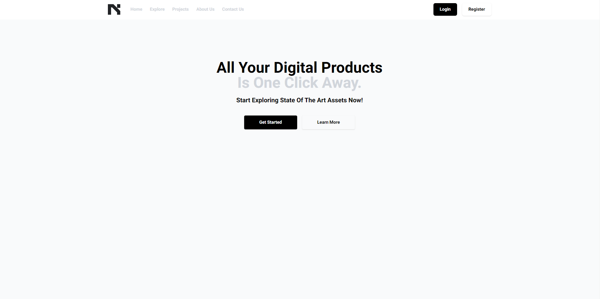
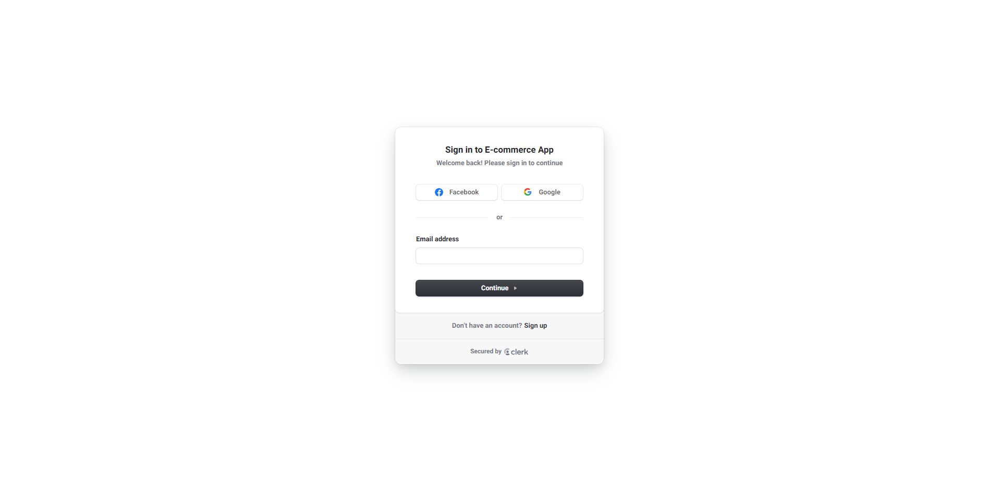
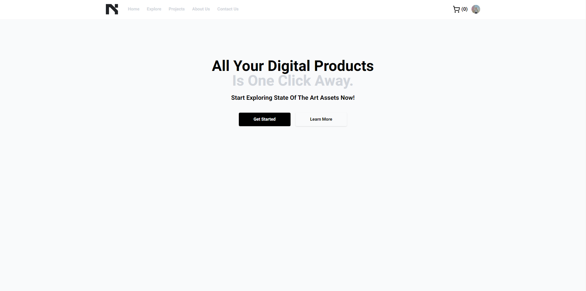
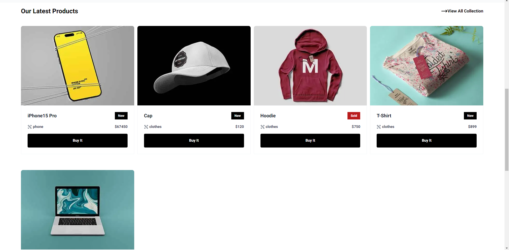
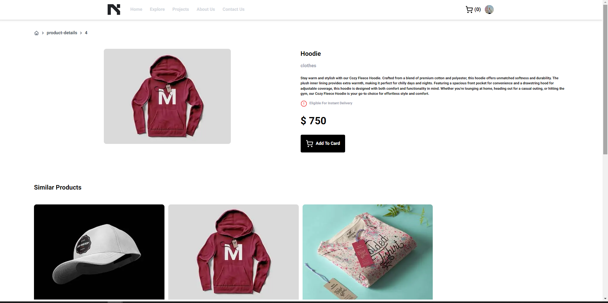
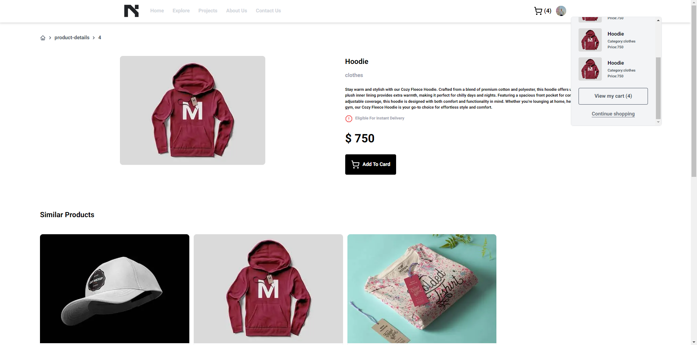
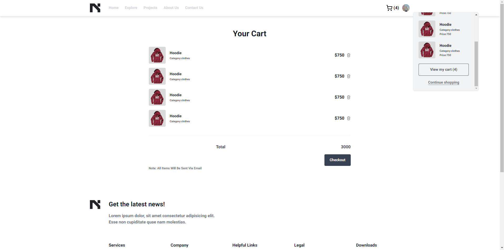
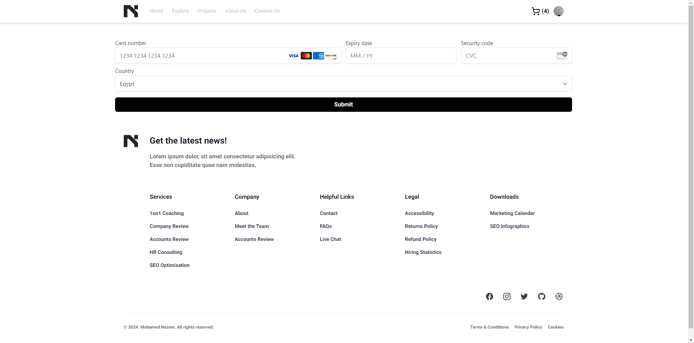

# Next-E-commerce System

This project is a fully-featured e-commerce system built with Next.js for the front end and Strapi for the backend. The system includes user authentication, product management, shopping cart functionality, and payment processing using Stripe. Additionally, Cloudinary is used for image management.

## Table of Contents

- [Overview](#overview)
- [Features](#features)
- [Tech Stack](#Tech-Stack)
- [Installation](#installation)
- [Usage](#usage)
- [Screenshots](#screenshots)
- [Contributing](#contributing)
- [Contact](#contact)

## Overview

The Next.js E-commerce System is designed to provide a seamless online shopping experience. It features a modern front end built with Next.js and a robust backend managed by Strapi. The system includes essential e-commerce functionalities such as product browsing, shopping cart management, and secure payment processing.

## Features

- User Authentication:
  User login and sign-up using @clerk/nextjs.
  Secure session management and user data protection.
- Product Management:
  Display all products.
  Individual product pages with detailed information.
- Shopping Cart:
  Add, update, and remove items from the cart.
  View cart summary with total price calculation.
- Payment Processing:
  Integration with Stripe for secure payments.
  Order confirmation and payment status handling.
- Image Management:
  Cloudinary integration for storing and managing product images.

## Tech Stack

- Frontend:
  Next.js
  React
  Tailwind CSS for styling
  @clerk/nextjs for authentication
  @stripe/react-stripe-js for Stripe integration
- Backend:
  Strapi for content management and API
  Cloudinary for image management

## Installation

To get started with the React Dashboard, follow these steps:

1. Clone the repository:

   ```sh
   git clone https://github.com/Nazeeer/E-commerce-system
   cd E-commerce-system
   ```

2. Install the dependencies:

   ```sh
   npm install
   ```

3. Start the development server:
   ```sh
   npm run dev
   ```

The application will be available at `http://localhost:3000`.

## Usage

To use the Next.js E-commerce System, follow the installation steps above. Once the development server is running, you can access the application in your web browser at http://localhost:3000.

Navigate through the products, add items to the shopping cart, and proceed with the checkout process to experience the full functionality of the system.

## Screenshots

Here are some screenshots of the E-commerce system:

### Open The Website Without Login



### Login



### Open The Website After Login



### All Products



### Product Details



### Cart



### Products Cart



### Payment



## Contributing

    Contributions are welcome! Please feel free to submit a Pull Request.

## Contact

    For any inquiries or issues, please contact:
    Name: Mohamed Nazeer
    Email: mohamed55nazeer55@gmail.com.com
    LinkedIn: https://www.linkedin.com/in/mohameddnazeer/
